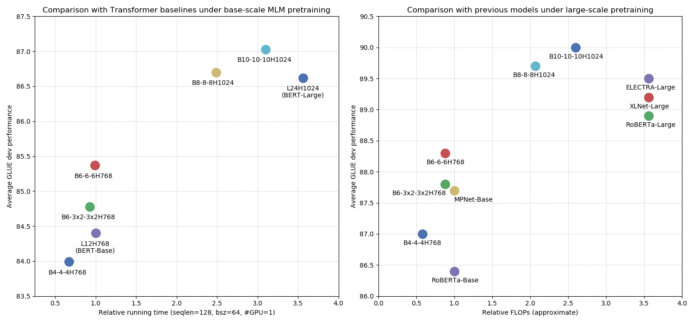
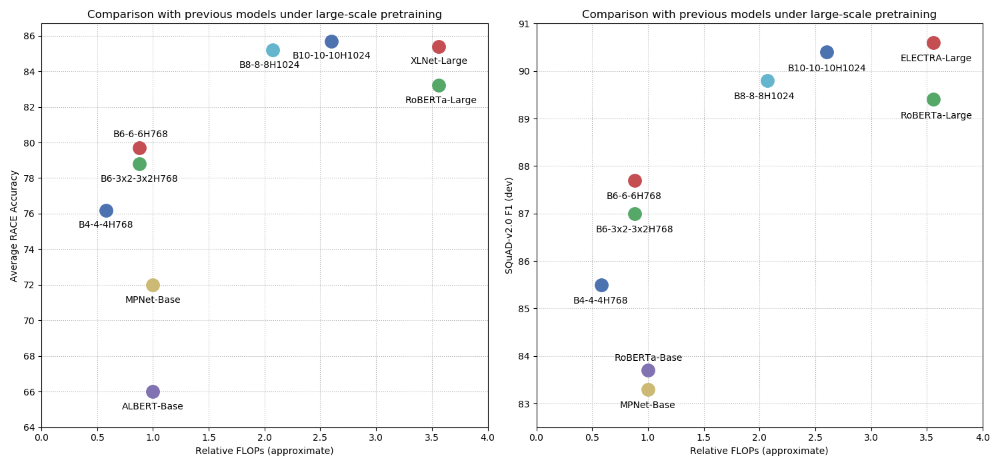

## Introduction

**Funnel-Transformer** is a new self-attention model that gradually compresses the sequence of hidden states to a shorter one and hence reduces the computation cost. More importantly, by re-investing the saved FLOPs from length reduction in constructing a deeper or wider model, Funnel-Transformer usually has a higher capacity given the same FLOPs. In addition, with a decoder, Funnel-Transformer is able to recover the token-level deep representation for each token from the reduced hidden sequence, which enables standard pretraining.

For a detailed description of technical details and experimental results, please refer to our paper:

> [Funnel-Transformer: Filtering out Sequential Redundancy for Efficient Language Processing](https://arxiv.org/abs/2006.03236)
>
> Zihang Dai\*, Guokun Lai*, Yiming Yang, Quoc V. Le 
>
> (*: equal contribution) 
>
> Preprint 2020
>

## Source Code

#### Data Download

- The corresponding source code and instructions are in the `data-scrips` folder, which specifies how to access the raw data we used in this work.

#### TensorFlow

- The corresponding source code is in the `tensorflow` folder, which was developed and exactly used for TPU pretraining & finetuning as presented in the paper.
- The TensorFlow funetuning code *mainly* supports TPU finetuining on GLUE benchmark, text classification, SQuAD and RACE.
- Please refer to `tensorflow/README.md` for details.

#### PyTorch

- The source code is in the `pytorch` folder, which only serves as an example PyTorch implementation of Funnel-Transformer. 
- Hence, the PyTorch code **only supports** GPU finetuning for the GLUE benchmark & text classification.
- Please refer to `pytorch/README.md` for details.

## Pretrained models

| Model Size     | PyTorch                                                      | TensorFlow                                                   | TensorFlow-Full                                              |
| -------------- | ------------------------------------------------------------ | ------------------------------------------------------------ | ------------------------------------------------------------ |
| B10-10-10H1024 | [Link](http://storage.googleapis.com/funnel-transformer/funnel_ckpts_all/B10-10-10H1024-ELEC-PT.tar.gz) | [Link](http://storage.googleapis.com/funnel-transformer/funnel_ckpts_all/B10-10-10H1024-ELEC-TF.tar.gz) | [Link](http://storage.googleapis.com/funnel-transformer/funnel_ckpts_all/B10-10-10H1024-ELEC-FULL-TF.tar.gz) |
| B8-8-8H1024    | [Link](http://storage.googleapis.com/funnel-transformer/funnel_ckpts_all/B8-8-8H1024-ELEC-PT.tar.gz) | [Link](http://storage.googleapis.com/funnel-transformer/funnel_ckpts_all/B8-8-8H1024-ELEC-TF.tar.gz) | [Link](http://storage.googleapis.com/funnel-transformer/funnel_ckpts_all/B8-8-8H1024-ELEC-FULL-TF.tar.gz) |
| B6-6-6H768     | [Link](http://storage.googleapis.com/funnel-transformer/funnel_ckpts_all/B6-6-6H768-ELEC-PT.tar.gz) | [Link](http://storage.googleapis.com/funnel-transformer/funnel_ckpts_all/B6-6-6H768-ELEC-TF.tar.gz) | [Link](http://storage.googleapis.com/funnel-transformer/funnel_ckpts_all/B6-6-6H768-ELEC-FULL-TF.tar.gz) |
| B6-3x2-3x2H768 | [Link](http://storage.googleapis.com/funnel-transformer/funnel_ckpts_all/B6-3x2-3x2H768-ELEC-PT.tar.gz) | [Link](http://storage.googleapis.com/funnel-transformer/funnel_ckpts_all/B6-3x2-3x2H768-ELEC-TF.tar.gz) | [Link](http://storage.googleapis.com/funnel-transformer/funnel_ckpts_all/B6-3x2-3x2H768-ELEC-FULL-TF.tar.gz) |
| B4-4-4H768     | [Link](http://storage.googleapis.com/funnel-transformer/funnel_ckpts_all/B4-4-4H768-ELEC-PT.tar.gz) | [Link](http://storage.googleapis.com/funnel-transformer/funnel_ckpts_all/B4-4-4H768-ELEC-TF.tar.gz) | [Link](http://storage.googleapis.com/funnel-transformer/funnel_ckpts_all/B4-4-4H768-ELEC-FULL-TF.tar.gz) |

Each `.tar.gz` file contains three items:

*   A TensorFlow or PyTorch checkpoint (`model.ckpt-*` or `model.ckpt.pt`)  checkpoint containing the pre-trained weights (Note: The TensorFlow checkpoint actually corresponds to 3 files).
*   A [Word Piece](https://github.com/google-research/bert) model (`vocab.uncased.txt`) used for (de)tokenization.
*   A config file (`net_config.json` or `net_config.pytorch.json`) which specifies the hyperparameters of the model.

You also can use `download_all_ckpts.sh` to download all checkpoints mentioned above. 

For how to use the pretrained models, please refer to `tensorflow/README.md`  or  `pytorch/README.md` respectively.

## Results

